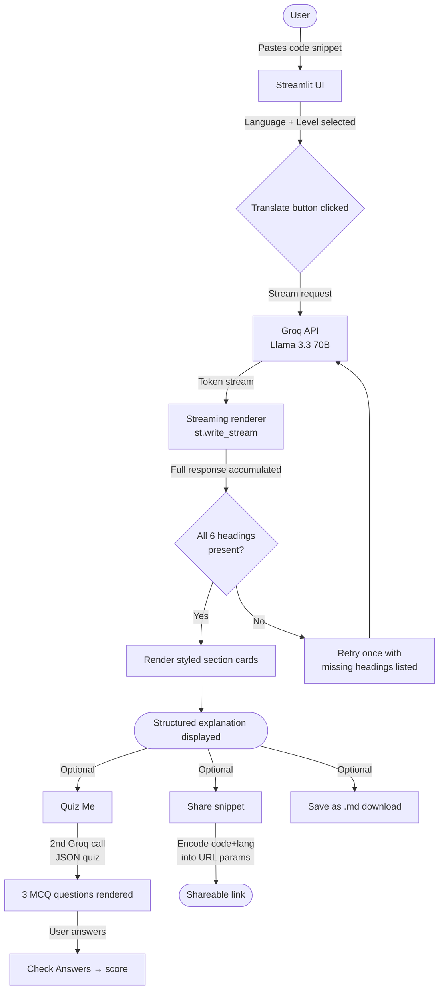
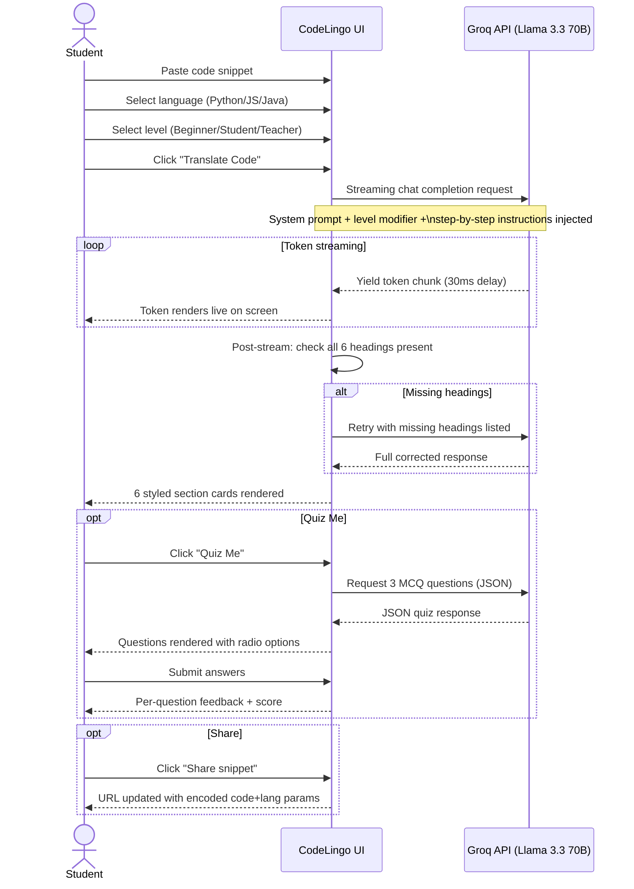

# 🌐 CodeLingo

**Translate code into human reasoning.**

CodeLingo is an AI-powered code explanation tool built for students who can *write* code but struggle to *read* it. Paste any snippet, choose an explanation level, and get a structured, pedagogically-sound breakdown instantly — no login, no setup, just understanding.

> Built for the 2026 CodeHS Summer Intern Challenge.

---

## Why CodeLingo?

Learning to program is like learning a new language. Most beginner tools focus on teaching students to *write* code — but very few help them *understand* code they encounter in the wild. This gap prevents students from debugging, learning from examples, or building a real mental model of how programs execute.

CodeLingo bridges that gap. It's built specifically for the three languages CodeHS teaches — Python, JavaScript, and Java — and produces explanations calibrated to the student's actual level.

---

## Architecture



---

## User Flow



---

## Features

### Core
| Feature | Detail |
|---|---|
| **3 explanation levels** | Beginner (no jargon, age-12 analogies), Student (correct terminology, edge cases), Teacher (pedagogical notes, curriculum connections) |
| **3 languages** | Python, JavaScript, Java — CodeHS's primary languages |
| **6 structured output sections** | Human Translation · Line-by-Line · Step-by-Step Execution · Why This Code Exists · Common Beginner Mistakes · Key Concepts |
| **Level-adapted Step-by-Step** | Every line quoted in a code block, explained with depth calibrated to the chosen level |
| **Live token streaming** | Output renders word-by-word at ~30ms/token — feels like a real AI product, not a form submission |

### Reliability
| Feature | Detail |
|---|---|
| **Auto-retry on drift** | If Groq skips any of the 6 required headings, the app retries once with the missing headings listed |
| **Safe fallback** | If retry still fails, raw output is wrapped under `### Human Translation` — the UI never breaks |
| **Stateless** | No database, no auth, no session server — everything lives in `st.session_state` |

### UX & Utility
| Feature | Detail |
|---|---|
| **Quiz Me** | Generates 3 multiple-choice comprehension questions from the same code + level; renders with radio inputs, per-question feedback, and a final score |
| **Misconceptions only toggle** | Filters the rendered output to show only `### Common Beginner Mistakes` — useful for teachers reviewing before class |
| **Save as .md** | Downloads the full explanation as a Markdown file |
| **Share snippet** | Encodes the current code + language into the URL so anyone can visit a link and get the snippet pre-loaded |
| **3 sidebar examples** | One-click Python, JavaScript, and Java examples to demo the tool instantly |
| **Dark theme** | Full dark mode via `.streamlit/config.toml` — purple/blue gradient accent, styled section cards, monospace code textarea |

---

## Output Structure

Every translation always returns exactly these 6 sections:

```
### Human Translation
Plain-English summary of what the code does.

### Line-by-Line Explanation
Each line explained in sequence.

### Step-by-Step Execution
Every line quoted in a code block with execution walkthrough.
Depth and vocabulary calibrated to the chosen level.

### Why This Code Exists
The purpose and real-world use case.

### Common Beginner Mistakes
What beginners typically get wrong with this type of code.

### Key Concepts
Concepts demonstrated: loops, scope, async/await, OOP, etc.
```

---

## Tech Stack

| Layer | Choice | Why |
|---|---|---|
| UI | Streamlit | Fastest path from Python to a shareable web app |
| AI | Groq + Llama 3.3 70B Versatile | 14,400 free requests/day, no credit card, streaming support, strong structured reasoning |
| Secrets | `python-dotenv` + `st.secrets` | Dual loading — works locally and on Streamlit Cloud without code changes |
| Deployment | Streamlit Community Cloud | Free, permanent public URL, connects directly to GitHub |

---

## Local Setup

### 1. Clone

```bash
git clone git@github.com:ak23bar/CodeLingo.git
cd CodeLingo
```

### 2. Install dependencies

```bash
pip install -r requirements.txt
```

### 3. Get a free Groq API key

Sign up at [console.groq.com](https://console.groq.com) — no credit card required.

### 4. Set your API key

Create a `.env` file in the project root:

```
GROQ_API_KEY=your_key_here
```

### 5. Run

```bash
streamlit run app.py
```

Opens at `http://localhost:8501`.

---

## Deploy to Streamlit Community Cloud

1. Push this repo to GitHub (`.env` is gitignored).
2. Go to [share.streamlit.io](https://share.streamlit.io) and sign in with GitHub.
3. **New app** → select `ak23bar/CodeLingo` → main file: `app.py`.
4. **Advanced settings → Secrets**, add:

```toml
GROQ_API_KEY = "your_key_here"
```

5. Click **Deploy** → permanent public URL in ~60 seconds.

---

## Project Structure

```
CodeLingo/
├── app.py                  # Full Streamlit app — UI, streaming, quiz, share
├── requirements.txt        # streamlit, groq, python-dotenv
├── README.md
├── LICENSE
├── .env                    # Local API key (gitignored)
├── .gitignore
└── .streamlit/
    ├── config.toml         # Dark theme configuration
    └── secrets.toml        # Streamlit Cloud API key (gitignored)
```

---

## License

MIT License © 2026 [ak23bar](https://github.com/ak23bar)

See [LICENSE](LICENSE) for full terms. Free to use, modify, and distribute with attribution.
